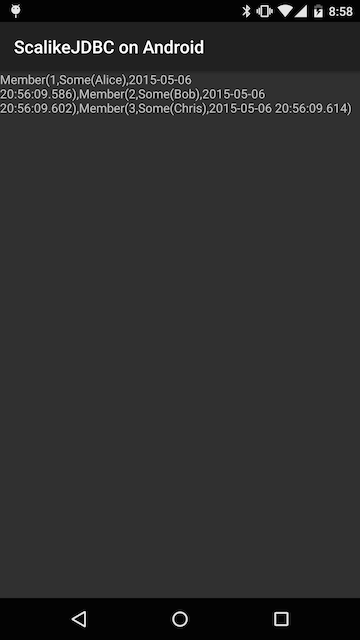

#ScalikeJDBC on Android SQLite

#How to use
1. [Install Android SDK](https://developer.android.com/intl/ja/sdk/installing/index.html?pkg=tools).
2. Install Android API 5.1 via `android` command.
3. Fill the path to your android SDK directory in  `local.properties.template`.
4. Rename `local.properties.template` to `local.properties`.
5. Connect your Android device with your machine via USB.
6. Run `sbt android:run` command.

#Result
